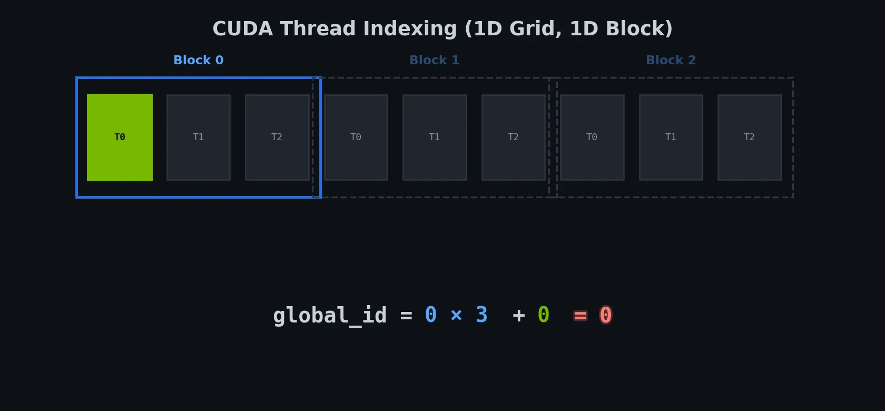
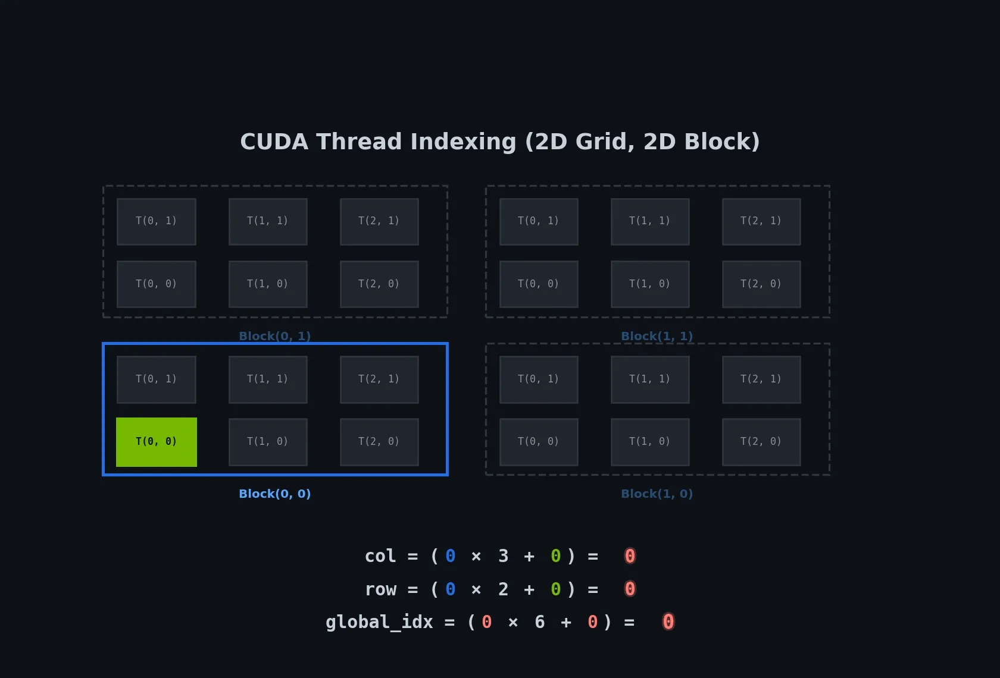
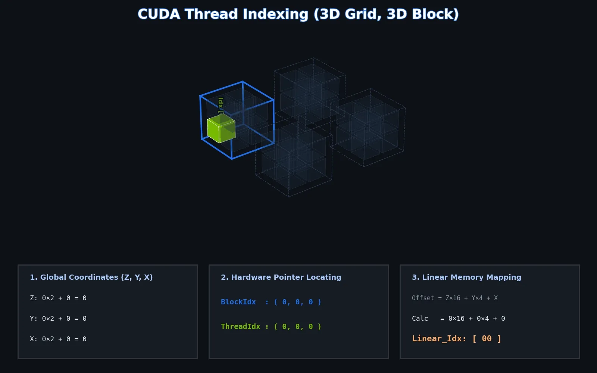

# CUDA 全局位置计算

CUDA 为每个线程提供了四个内置变量，用于定位自己在整个任务中的位置：

| 变量                | 含义             | 维度范围                          |
| :------------------ | :--------------- | :-------------------------------- |
| `threadIdx.x/y/z`   | 线程在块内的局部索引 | `0` ~ `blockDim-1`                |
| `blockIdx.x/y/z`    | 线程块在网格内的索引 | `0` ~ `gridDim-1`                 |
| `blockDim.x/y/z`    | 每个块每维的线程数 | 由启动参数 `<<<..., threads>>>` 决定 |
| `gridDim.x/y/z`     | 网格每维的块数    | 由启动参数 `<<<grid, ...>>>` 决定    |

全局索引的本质：**跳过前面所有块的线程，再加上在当前块内的偏移**。

> 无论数据是几维，内存中都是一维线性排布。全局坐标计算的核心任务，就是将多维逻辑索引映射为一维物理地址。

## 一维坐标计算

```cpp
int global_id = blockIdx.x * blockDim.x + threadIdx.x;
```



- `blockIdx.x * blockDim.x`：计算当前块之前一共有多少个线程（基地址）。
- `+threadIdx.x`：加上当前线程在块内的偏移。

进行边界保护：

```cpp
if (global_id < N) {
    // 安全处理
}
```

> [!NOTE]
> 为什么必须加这个判断？
>
> 答：网格覆盖的线程总数往往是块大小的整数倍，可能超过数据总量 N。不加判断会越界访问。

## 二维坐标计算

二维数据（如图像）需要两个全局索引：row 和 col。

```cpp
// 列方向，当前块之前的数量 * 每块宽度 + 当前块内的线程偏移
int col = blockIdx.x * blockDim.x + threadIdx.x;
// 行方向，当前块之前的数量 * 每块高度 + 当前块内的线程偏移
int row = blockIdx.y * blockDim.y + threadIdx.y;


// 我们只需要利用行优先规则转换
if (row < height && col < width) {
    int global_idx = row * width + col;            // 转为一维线性地址
}
```



**例子：RGB 图像转灰度图**

```bash
sudo apt update
sudo apt install libopencv-dev
```

在一个 Kernel 中，每个线程负责处理图像中的一个像素点。

```cpp
// 输入图像在显存中是按 uchar3 (RGB三通道) 紧密排列的
__global__ void rgbToGray(const uchar3* d_img, unsigned char* d_gray, int width, int height) {
    // 计算全局列和行
    int x = blockIdx.x * blockDim.x + threadIdx.x;//x横向代表列
    int y = blockIdx.y * blockDim.y + threadIdx.y;//y纵向代表行

    // 边界检查
    if (x < width && y < height) {
        // 二维转一维索引
        int idx = y * width + x;

        // 读取原始 RGB 像素
        uchar3 pixel = d_img[idx];

        // 计算灰度值 (固定加权公式)
        // Y = 0.299R + 0.587G + 0.114B
        unsigned char gray = static_cast<unsigned char>(0.299f * pixel.x + 0.587f * pixel.y + 0.114f * pixel.z);

        // 写回显存
        d_gray[idx] = gray;
    }
}
```

主函数：

```cpp
using namespace std;
int main() {
    string imagePath = "input.png";
    cv::Mat img = cv::imread(imagePath);

    // 检查图像是否加载成功
    if (img.empty()) {
        cerr << "无法加载图像: " << imagePath << endl;
        return -1;
    }

    int width = img.cols;
    int height = img.rows;
    int channels = img.channels();

    uchar* d_img;           // GPU上的原始图像数据
    unsigned char* d_gray;  // GPU上的灰度图像
    cout << "图像尺寸: " << width << "x" << height << ", 通道数: " << channels << endl;


    // 定义CUDA内核的块和网格大小
    dim3 blockSize(1, 256);  //
    const int iterations = 10000;

    size_t imgSize = width * height * sizeof(uchar3);
    size_t graySize = width * height * sizeof(unsigned char);

    // 在GPU上分配内存
    cudaMalloc(&d_img, imgSize);
    cudaMalloc(&d_gray, graySize);

    // 将图像数据从CPU复制到GPU
    cudaMemcpy(d_img, img.data, imgSize, cudaMemcpyHostToDevice);


    // 取上整除以确保覆盖所有像素,计算 gridSize（即网格在 x 和 y 方向上分别需要多少个线程块）
    dim3 gridSize((width + blockSize.x - 1) / blockSize.x, (height + blockSize.y - 1) / blockSize.y);


    // 启动CUDA内核进行RGB到灰度的转换
    rgbToGray<<<gridSize, blockSize>>>(reinterpret_cast<uchar3*>(d_img), d_gray, width, height);
    // 检查内核启动是否成功
    cudaGetLastError();
    // 同步
    cudaDeviceSynchronize();


    // 测试时间
    cudaEvent_t start, stop;
    float total_time = 0.0f;

    cudaEventCreate(&start);
    cudaEventCreate(&stop);
    cout << "正在测试GPU性能..." << endl;

    for (int i = 0; i < iterations; i++) {
        cudaEventRecord(start);
        rgbToGray<<<gridSize, blockSize>>>(reinterpret_cast<uchar3*>(d_img), d_gray, width, height);
        cudaEventRecord(stop);
        cudaEventSynchronize(stop);

        float single_time = 0.0f;
        cudaEventElapsedTime(&single_time, start, stop);
        total_time += single_time;
    }

    float avg_time = total_time / iterations;
    cout << "平均每次转换时间: " << avg_time << " ms" << endl;


    // 将结果从GPU复制回CPU
    cv::Mat grayImg(height, width, CV_8UC1);
    cudaMemcpy(grayImg.data, d_gray, graySize, cudaMemcpyDeviceToHost);
    // 保存灰度图像
    cv::imwrite("output.png", grayImg);
    // 释放GPU内存
    cudaFree(d_img);
    cudaFree(d_gray);


    return 0;
}
```

## 三维坐标计算

假设有一个 256 × 256 × 128 的 CT 图像（宽×高×深度），每个体素是一个 16 位整数。我们要用 CUDA 把它变成浮点数，并除以最大灰度值，得到归一化的 3D 数组。

图示：



内存布局：

```cpp
int x = blockIdx.x * blockDim.x + threadIdx.x; //横轴
int y = blockIdx.y * blockDim.y + threadIdx.y; //纵轴
int z = blockIdx.z * blockDim.z + threadIdx.z; //z轴

if (x < dimX && y < dimY && z < dimZ) {


    // 因为内存布局是行优先，而x是变化最快的，因此这种访问方式能够让线程访问连续的x，能够合并内存访问，性能较好。
    int global_idx = (z * dimY * dimX) + (y * dimX) + x;
}
```

> [!NOTE] 三维块的硬件限制
>
> CUDA 规定每个 Block 的总线程数不能超过 1024。三维块尺寸乘积必须 ≤ 1024，例如 8×8×8 = 512 合法，16×16×16 = 4096 非法。

核心的 kernel：

```cpp
__global__ void normalizeVolume(const unsigned short* d_in,
                                float* d_out,
                                int dimX, int dimY, int dimZ,
                                float maxVal) {
    int x = blockIdx.x * blockDim.x + threadIdx.x;
    int y = blockIdx.y * blockDim.y + threadIdx.y;
    int z = blockIdx.z * blockDim.z + threadIdx.z;

    if (x < dimX && y < dimY && z < dimZ) {
        int idx = z * dimY * dimX + y * dimX + x;
        d_out[idx] = (float)d_in[idx] / maxVal;
    }
}
```

## 启动 Kernel

告诉 GPU 启动多少线程，怎么分组，这就是 `<<<gridDim, blockDim>>>` 的作用。

CUDA 内核函数 `__global__` 中可以直接使用以下内置变量，无需声明。`dim3` 是 CUDA 内置的一个结构体，包含 xyz 三个无符号整数字段。

核心公式：

```cpp
全局线程ID = blockIdx维度 * blockDim维度 + threadIdx维度
```

启动 kernel 的配置：

```cpp
/* 一维配置 */
int threadsPerBlock = 256;
// 向上取整
int blocksPerGrid = (N + threadsPerBlock - 1) / threadsPerBlock;
kernel<<<blocksPerGrid, threadsPerBlock>>>(d_data, N);


/* 二维配置 */
dim3 blockSize(16, 16);          // 16×16 = 256 线程
dim3 gridSize( (width+15)/16, (height+15)/16 );
kernel<<<gridSize, blockSize>>>(d_image, width, height);


/* 三维配置 */
dim3 blockSize(8, 8, 4);        // 8×8×4 = 256 线程 ≤ 1024
dim3 gridSize( (dimX+7)/8, (dimY+7)/8, (dimZ+3)/4 );
kernel<<<gridSize, blockSize>>>(d_volume, dimX, dimY, dimZ);
```

> [!NOTE] 关于 dim3 的易错点
>
> - 没有赋值的维度默认为 1。例如 dim3 block(32, 32) → block.z = 1。
> - 内核中访问 threadIdx.z 是安全的，但如果启动时没给 z 值（或给了 1），它始终为 0。
> - 用整数直接传给 <<<>>> 时，相当于只设置了 .x 分量。例如 kernel<<<10, 256>>> 等价于 gridDim.x=10, blockDim.x=256，其他维为 1。

参数选择：

- threadsPerBlock：每个 Block 的线程数，通常取 32 的整数倍（如 128、256、512），避免 Warp 资源浪费。
- blocksPerGrid：向上取整确保覆盖全部数据。公式等价于 `ceil(N / threadsPerBlock)`。

**为什么二维配置常用 16×16 或 32×8？**

- 合并访问：x 维度的线程连续访问内存，性能最优。
- Warp 对齐：32 个线程为一个 Warp，块尺寸最好是 Warp 大小的倍数。
- 共享内存：二维块切出的瓦片（tile）更规整，便于利用共享内存。

> 思考题：16×16 和 32×8 的块，哪个更适合处理 1024×1024 的图像？
>
> 提示：考虑合并访问和 Warp 利用率（32 个线程为一组）。32×8 的 x 维有 32 个线程，正好一个 Warp，合并访问效率最高。
